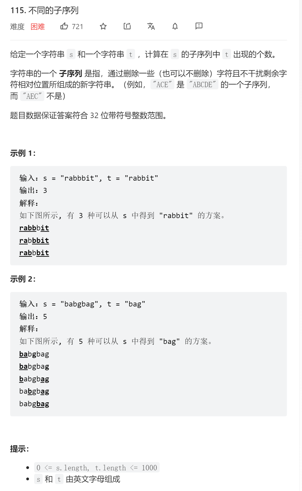

```python
class Solution:

	def numDistinct(self, s: str, t: str) -> int:
		# dp[i][j] s的前i个字符组成t的前j个字符的组合个数
		dp = [[0] * (len(t) + 1) for _ in range(len(s) + 1)]
		for k in range(len(s)+1):
			dp[k][0] = 1
		for i in range(1, len(s)+1):
			for j in range(1, len(t)+1):
				if j > i:
					break
				if s[i-1] == t[j-1]:
					dp[i][j] = dp[i-1][j-1] + dp[i-1][j]
				else:
					dp[i][j] = dp[i-1][j]
		return dp[len(s)][len(t)]
 ```