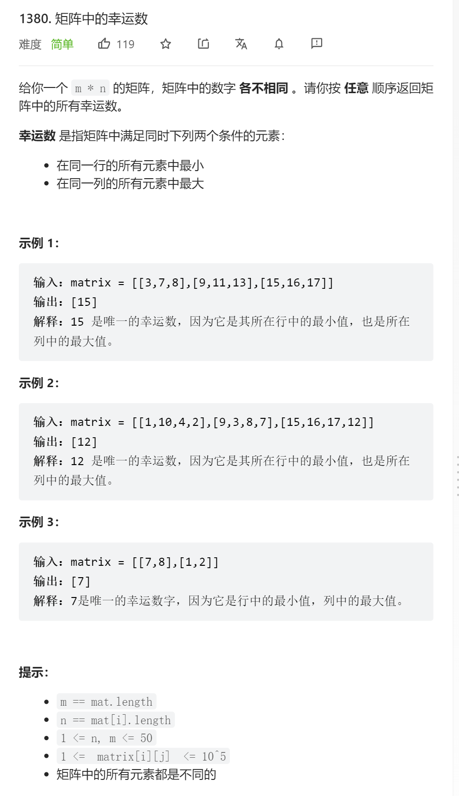

```python
class Solution:
    def luckyNumbers (self, matrix: List[List[int]]) -> List[int]:
        m = len(matrix)
        lucky = []
        for row in matrix:
            flag = False
            candidate = min(row);
            c_index = row.index(candidate)
            for r_index in range(m):
                if matrix[r_index][c_index] > candidate:
                    flag = True
                    break
            if not flag:
                lucky.append(candidate)
        return lucky
```