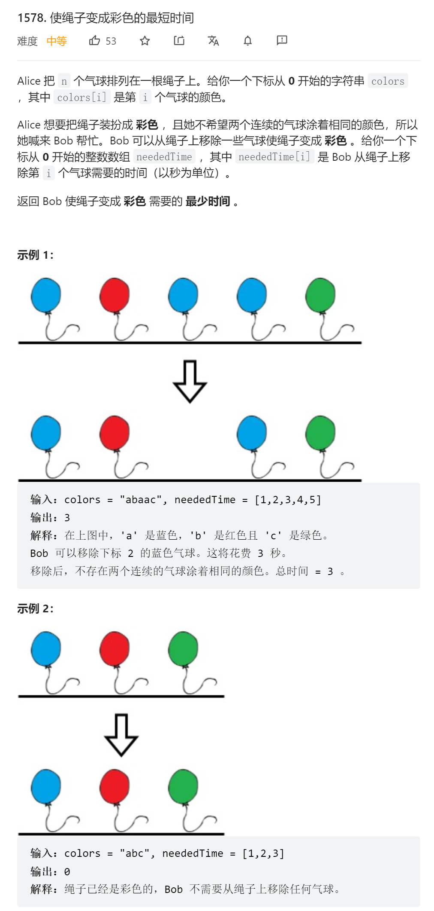

```python
class Solution:

    def minCost(self, colors: str, neededTime: List[int]) -> int:

        size = len(neededTime)
        all_need = 0

        p = 0
        pn = p + 1

        while p < size and pn < size:
            if colors[p] == colors[pn]:
                if neededTime[p] > neededTime[pn]:
                    # pn move
                    all_need += neededTime[pn]
                    pn += 1
                else:
                    # p move
                    all_need += neededTime[p]
                    p = pn
                    pn += 1
            else:
                p = pn
                pn = p + 1
        return all_need
```