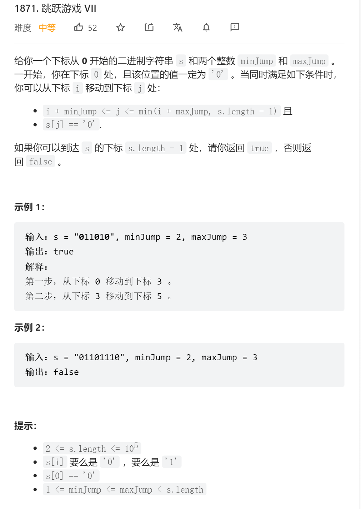

```python
class Solution:
    def canReach(self, s: str, minJump: int, maxJump: int) -> bool:
        n = len(s)
        f, pre = [0] * n, [0] * n
        f[0] = 1
        # 由于我们从 i=minJump 开始动态规划，因此需要将 [0,minJump) 这部分的前缀和预处理出来
        for i in range(minJump):
            pre[i] = 1
        for i in range(minJump, n):
            left, right = i - maxJump, i - minJump
            if s[i] == "0":
                total = pre[right] - (0 if left <= 0 else pre[left - 1])
                f[i] = int(total != 0)
            pre[i] = pre[i - 1] + f[i]

        return bool(f[n - 1])
```