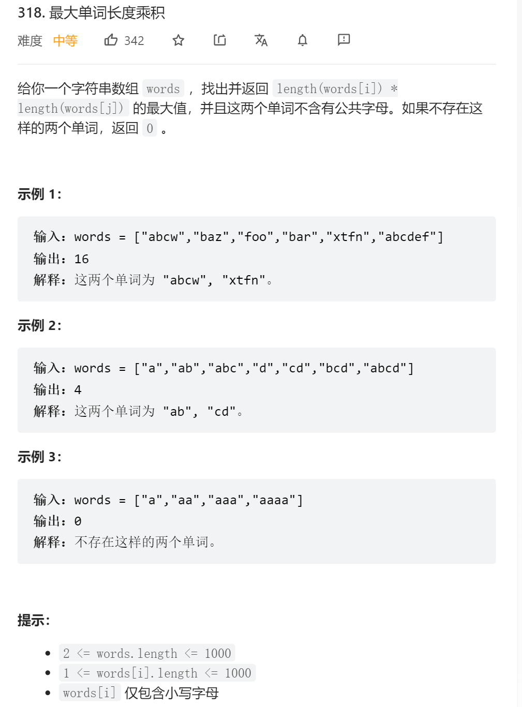

```python
class Solution:  
    def maxProduct(self, words: List[str]) -> int:  
        count_note = []  
        
        for i, w in enumerate(words):  
            line = [0] * 27  
			for c in w:  
                line[ord(c) - ord('a')] += 1  
				line[-1] += 1  
			 count_note.append(line)  
        count_note.sort(key=lambda x: -x[-1])  
        ml = [0]  
        for k in range(len(count_note)):  
	        for j in range(k+1, len(count_note)):  
	            is_break = False  
				for z in range(26):  
                    if count_note[k][z] > 0 and count_note[j][z] > 0:  
                        is_break = True  
                        break
				if not is_break:  
		            ml.append(count_note[k][-1] * count_note[j][-1])  
	                break  
		 return max(ml)
 ```