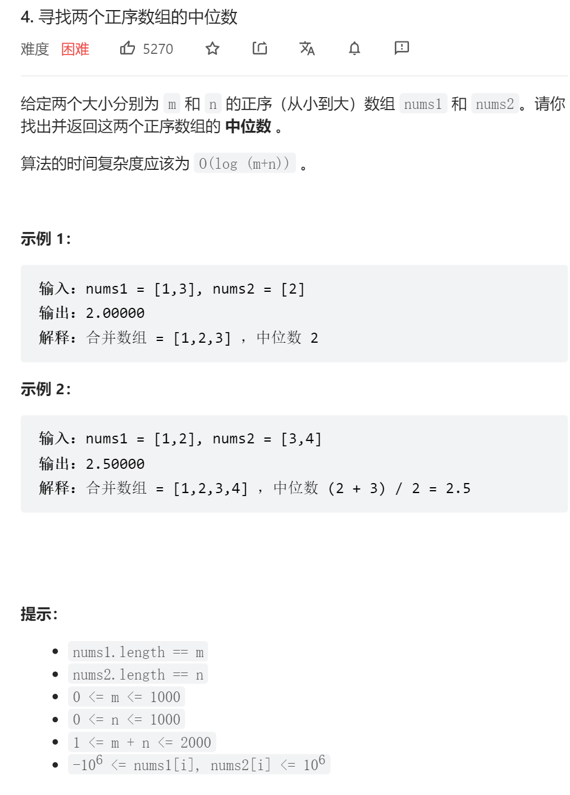

```python
class Solution:
    def findMedianSortedArrays(self, nums1: List[int], nums2: List[int]) -> float:
        if len(nums1) == 0:
            if len(nums2) % 2 == 0:
                return (nums2[int(len(nums2) / 2)] + nums2[int(len(nums2) / 2) - 1]) / 2
            return nums2[int(len(nums2) / 2)]
        if len(nums2) == 0:
            if len(nums1) % 2 == 0:
                return (nums1[int(len(nums1) / 2)] + nums1[int(len(nums1) / 2) - 1]) / 2
            return nums1[int(len(nums1) / 2)]
        ml = len(nums1) + len(nums2)
        choose1 = 0
        choose2 = 0
        if ml % 2 == 0:
            end = int(ml / 2)
            save_num = -1
            while choose1 + choose2 < end:
                if choose1 == len(nums1):
                    save_num = nums2[choose2]
                    choose2 += 1
                    continue
                if choose2 == len(nums2):
                    save_num = nums1[choose1]
                    choose1 += 1
                    continue
                if nums1[choose1] < nums2[choose2]:
                    save_num = nums1[choose1]
                    choose1 += 1
                else:
                    save_num = nums2[choose2]
                    choose2 += 1
            if choose1 == len(nums1):
                return (save_num + nums2[choose2]) / 2
            if choose2 == len(nums2):
                return (save_num + nums1[choose1]) / 2
            else:
                return (save_num + min(nums1[choose1], nums2[choose2])) / 2
        else:
            end = int(ml / 2)
            while choose1 + choose2 < end:
                if choose1 == len(nums1):
                    choose2 += 1
                    continue
                if choose2 == len(nums2):
                    choose1 += 1
                    continue
                if nums1[choose1] < nums2[choose2]:
                    choose1 += 1
                else:
                    choose2 += 1
            if choose1 == len(nums1):
                return nums2[choose2]
            if choose2 == len(nums2):
                return nums1[choose1]
            return min(nums1[choose1], nums2[choose2])
```