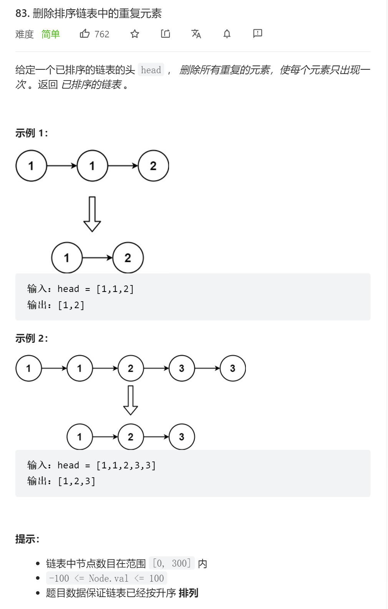

```python
# Definition for singly-linked list.
# class ListNode:
#     def __init__(self, val=0, next=None):
#         self.val = val
#         self.next = next
class Solution:
    def deleteDuplicates(self, head: ListNode) -> ListNode:
        if head is None:
            return head
        current_point = head
        while current_point.next is not None:
            if current_point.val == current_point.next.val:
                current_point.next = current_point.next.next
            else:
                current_point = current_point.next
        return head
```