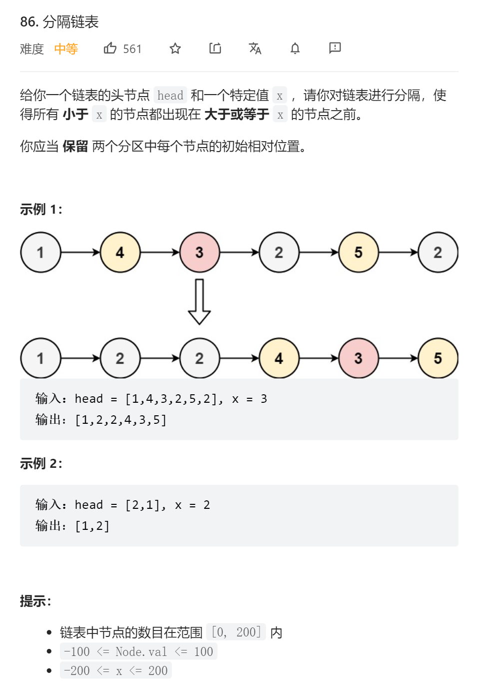

```python
# Definition for singly-linked list.
# class ListNode(object):
#     def __init__(self, val=0, next=None):
#         self.val = val
#         self.next = next
class Solution(object):
    def partition(self, head, x):
        """
        :type head: ListNode
        :type x: int
        :rtype: ListNode
        """
        stand = None
        none_head = ListNode(-1, head)
        pre_p = none_head
        p = head
        while p:
            if stand is None:
                if p.val < x:
                    pre_p = p
                    p = p.next
                    continue
                stand = pre_p
                continue
            if p.val < x:
                pre_p.next = p.next
                p.next = stand.next
                stand.next = p
                stand = p
                p = pre_p.next
            else:
                pre_p = p
                p = p.next
        return none_head.next  
```