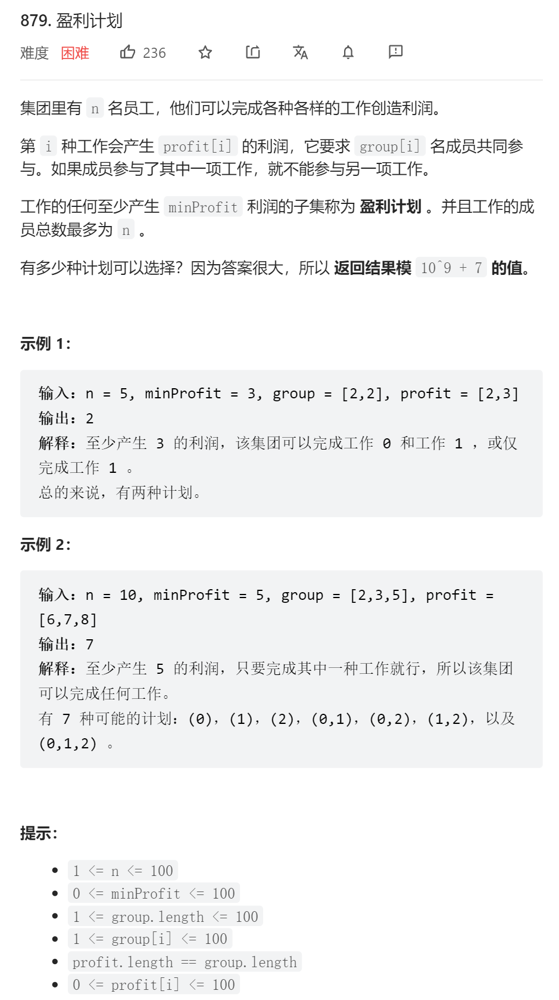

```python
import numpy as np  
  
class Solution:  
    def profitableSchemes(self, n: int, minProfit: int, group: List[int], profit: List[int]) -> int:  
        mod = int(1e9+7)  
        gpl = len(group)  
        f = np.zeros(shape=(gpl+1, n+1, minProfit+1), dtype=int)  
        f[0, :, 0] = 1  
		for i in range(1, gpl+1):  
            c_g = group[i-1]  
            c_p = profit[i-1]  
            for j in range(n+1):  
                for k in range(minProfit+1):  
                    f[i, j, k] = f[i-1][j][k]  
                    if j >= c_g:  
                        u = max(k - c_p, 0)  
                        f[i, j, k] += f[i-1, j-c_g, u]  
                    if f[i, j, k] > mod:  
                        f[i, j, k] -= mod  
        return int(f[gpl, n, minProfit])
 ```
