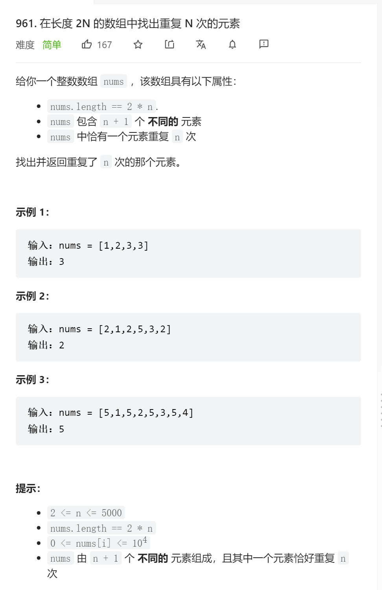

```python
class Solution(object):
    def repeatedNTimes(self, nums):
        """
        :type nums: List[int]
        :rtype: int
        """
        sum_list = sum(nums)
        sum_set = sum(set(nums))
        all_n = sum_list - sum_set
        l = len(nums)
        n = all_n // (l / 2 - 1)
        return n
```